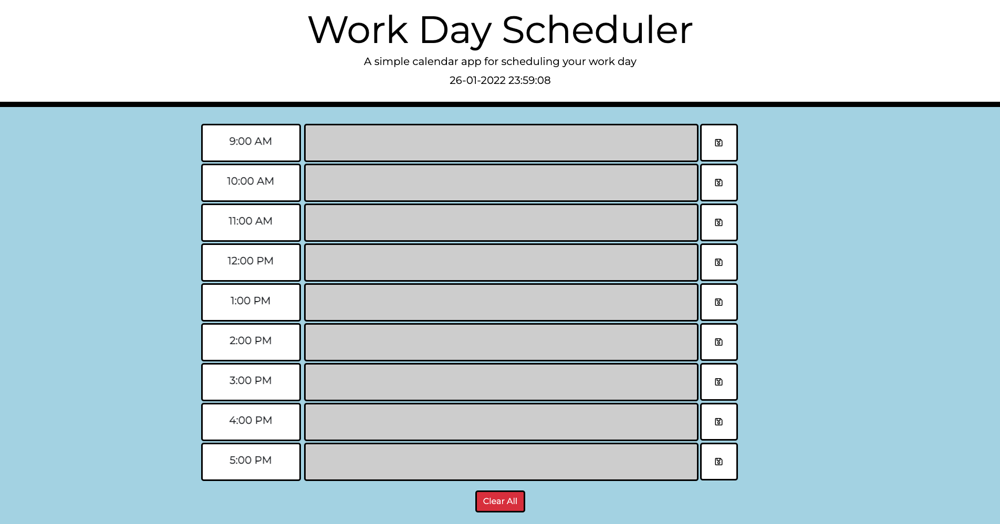

# Work Day Scheduler

## Project Background
An application that allows an employee with a busy schedule to save important events to a daily planner so that they can manage their time effectively.

## Course of Action
- Live date and time is displayed at the top of the calendar.
- Important events can be entered and saved into the daily planner.
- Timeblocks are colour-coded to display whether time is in the past, present or future.
- Save button is clicked to save the event in local storage.
- User returns to find event is still visible, even after page is refreshed.
- Clear All button removes saved items from local storage.

## Git Hub Repository
The link takes you to the repository where the portfolio is hosted.
https://github.com/tahlialg/work-day-scheduler 

## Deployed Application
The link showcases the deployed password generator.
https://tahlialg.github.io/work-day-scheduler/

